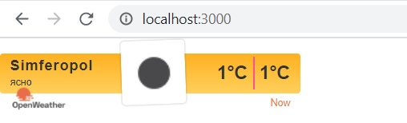
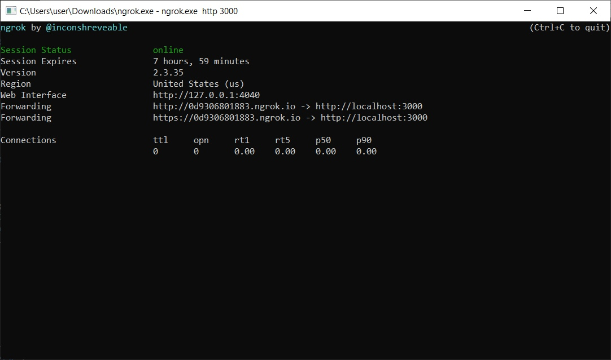
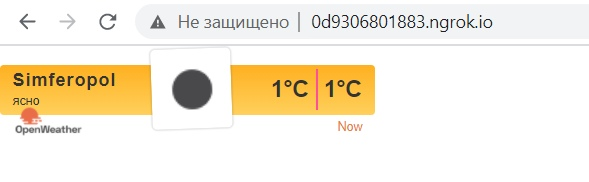

<p align="center">МИНИСТЕРСТВО НАУКИ  И ВЫСШЕГО ОБРАЗОВАНИЯ РОССИЙСКОЙ ФЕДЕРАЦИИ<br>
Федеральное государственное автономное образовательное учреждение высшего образования<br>
"КРЫМСКИЙ ФЕДЕРАЛЬНЫЙ УНИВЕРСИТЕТ им. В. И. ВЕРНАДСКОГО"<br>
ФИЗИКО-ТЕХНИЧЕСКИЙ ИНСТИТУТ<br>
Кафедра компьютерной инженерии и моделирования</p>
<br>
<h3 align="center">Отчёт по лабораторной работе № 1<br> по дисциплине "Программирование"</h3>
<br><br>
<p>студента 1 курса группы ПИ-б-о-201(1)<br>
Ильясов Эмир Шухратович<br>
направления подготовки 09.03.04 "Программная инженерия"</p>
<br><br>
<table>
<tr><td>Научный руководитель<br> старший преподаватель кафедры<br> компьютерной инженерии и моделирования</td>
<td>(оценка)</td>
<td>Чабанов В.В.</td>
</tr>
</table>
<br><br>
<p align="center">Симферополь, 2020</p>
<hr>

## Цель:

1. Закрепить навыки разработки многофайловыx приложений;
2. Изучить способы работы с API web-сервиса;
3. Изучить процесс сериализации/десериализации данных в/из json;
4. Получить базовое представление о сетевом взаимодействии приложений;

## Постановка задачи
Разработать сервис предоставляющий данные о погоде в городе Симферополе на момент запроса.  В качестве источника данных о погоде используйте: http://openweathermap.org/. В состав сервиса входит: серверное приложение на языке С++ и клиентское приложение на языке Python.

Серверное приложение (далее Сервер) предназначенное для обслуживания клиентских приложений и минимизации количества запросов к сервису openweathermap.org. Сервер должен обеспечивать возможность получения данных в формате JSON и виде html виджета (для вставки виджета на страницу будет использоваться iframe).

Клиентское приложение должно иметь графический интерфейс отображающий сведения о погоде и возможность обновления данных по требованию пользователя.

## Выполнение работы
Для начала была изучена структура HTTP-запроса, а также документация к API openwheatermap.org. После прохождения регистрации был создан API ключ: f28692897248be9c0d6256bb0c2b9097.

Затем были произведены несколько тестовых запросов, чтобы исключить в дальнейшем ошибки и посмотреть на ответы сервера.

Запрос, созданный к серверу погоды включает в себя широту и долготу места, для которого необходимо получить погоду, исключение всех типов прогноза, кроме почасового, ключ API, метрические единицы изменения (цельсий) и описание на русском языке: 

api.openweathermap.org/data/2.5/onecall?lat=45.0522222222&lon=33.9744444444&exclude=current,minutely,daily,alerts&appid=dc758a9b35a2f4d21c410e66b9eb1df5&units=metric&lang=ru

Запрос для сервера времени включает в себя город, время которого необходимо получить:

http://worldtimeapi.org/api/timezone/Europe/Simferopol

Исходный код сервера:
```cpp
#include "pch.h"
#include <iostream>
#include <string>
#include <cpp_httplib/httplib.h>
#include <nlohmann/json.hpp>
using namespace httplib;
std::ostringstream ostr;

std::string latitude = "45.0522222222";
std::string longitude = "33.9744444444";
std::string exclude = "current,minutely,daily,alerts";
std::string lang = "ru";
std::string units = "metric";
std::string appid = "f28692897248be9c0d6256bb0c2b9097";

using json = nlohmann::json;
json cache;


int get_time() {
	Client time("http://worldtimeapi.org");
	auto res = time.Get("/api/timezone/Europe/Simferopol");
	if (res) {
		if (res->status == 200) {
			json j = json::parse(res->body);
			int unixtime = j["unixtime"];
			return unixtime;
		}
		else {
			std::cout << "Status code time: " << res->status << std::endl;
		}
	}
	else {
		auto err = res.error();
		std::cout << "Error code: " << err << std::endl;
	}
}

json get_weather() {
	Client cli("http://api.openweathermap.org");
	std::string request = "/data/2.5/onecall?lat=" + latitude + "&lon=" + longitude + "&exclude=" + exclude + "&appid=" + appid + "&units=" + units + "&lang=" + lang;
	auto res = cli.Get(request.c_str());
	json j2;
	if (res) {
		if (res->status == 200) {
			json j = json::parse(res->body);
			std::cout << "Response is good" << std::endl;
			return j["hourly"];
		}
		else {
			std::cout << "Status code: " << res->status << std::endl;
			return "error";
		}
	}
	else {
		auto err = res.error();
		std::cout << "Error code: " << err << std::endl;
		return "error";
	}
}

void replaceHtml(std::string& data, std::string toSearch, std::string replaceStr) {
	size_t pos = data.find(toSearch);
	while (pos != std::string::npos) {
		data.replace(pos, toSearch.size(), replaceStr);
		pos = data.find(toSearch, pos + replaceStr.size());
	}
}


int cache_time(int unixtime) {
	
	for (int i = 0; i < cache.size(); i++) {
		int cache_time = cache[i]["dt"];
		if ((unixtime - cache_time < 3600) && (unixtime - cache_time > 0)) {
			return i;
		}
	}
	return -1;
}


void gen_response(const Request& req, Response& res) {

	std::string http_templ = R"(<!DOCTYPE html>
<html lang="ru"><head><meta http-equiv="Content-Type" content="text/html; charset=UTF-8">
	
	<meta name="viewport" content="width=device-width, initial-scale=1.0">
	<title>Погода сейчас</title>
<style type="text/css">
body {
	margin: 0;
	padding: 0;
}
.container-widget--18 {
	margin-top: 15px;
}
</style>
<link rel="stylesheet" type="text/css" href="chrome-extension://onbkopaoemachfglhlpomhbpofepfpom/styles.css"></head>
<body>
<div id="openweathermap-widget-18" class="container-widget container-widget--18">
	<div id="container-openweathermap-widget-18">
		<link href="http://openweathermap.org/themes/openweathermap/assets/vendor/owm/css/openweathermap-widget-right.min.css" rel="stylesheet">
		<div class="widget-right widget-right--type5 widget-right--brown">
			<div class="widget-right__layout widget-right__layout--brown">
				<div class="widget-right-card">
					<div class="widget-right__title">Simferopol</div>
					<div class="widget-right__description">{hourly[i].weather[0].description}</div>
                    </div>
                    <table class="weather-right-card">
                      <tbody><tr class="weather-right-card__items">
                        <td class="weather-right-card__item weather-right-card__temperature-min">{hourly[i].temp}<span>&degC</span></td>
						<td class="weather-right-card__item weather-right-card__temperature-min">{hourly[i].temp}<span>&degC</span></td>
                      </tr>
                    </tbody></table>
                  </div>
                  <div class="widget-right__footer widget-right__footer--brown">
                    <div class="widget-right__layout">
                        <div class="widget-right__logo_container widget-right__negative_top_container">
                            <a href="http://openweathermap.org/" target="_blank"><div class="widget-right__logo_black_small"></div></a>
                        </div>
                        <div class="widget-right__date">Now</div>
                      </div>
                  </div>
                </div></div></div>

<div class="mallbery-caa" style="z-index: 2147483647 !important; text-transform: none !important; position: fixed;"></div></body></html>)";

	int time = get_time();

	if (cache.empty()) {
		cache = get_weather();
	}

	int i = cache_time(time);

	int check = 1;
	while (check == 1) {
		if (i == -1) {
			cache = get_weather();
			int i = cache_time(time);
		}
		else {
			double temp_cache = cache[i]["temp"];
			int temp = round(temp_cache);

			replaceHtml(http_templ, "{hourly[i].weather[0].description}", cache[i]["weather"][0]["description"]);
			replaceHtml(http_templ, "{hourly[i].weather[0].icon}", cache[i]["weather"][0]["icon"]);
			replaceHtml(http_templ, "{hourly[i].temp}", std::to_string(temp));

			check = 0;

			res.set_content(http_templ, "text/html");
		}
	}

}

void gen_response_raw(const Request& req, Response& res) {

	int time = get_time();

	if (cache.empty()) {
		cache = get_weather();
	}

	int i = cache_time(time);

	bool check = 1;
	while (check == 1) {
		if (i == -1) {
			cache = get_weather();
			int i = cache_time(time);
		}
		else {
			check = 0;
			double temp_cache = cache[i]["temp"];
			int temp = round(temp_cache);

			json j3;
			j3["temp"] = temp;
			j3["description"] = cache[0]["weather"][0]["description"];
			res.set_content(j3.dump(), "text/json");
		}
	}
}

int main() {
	setlocale(LC_ALL, "Russian");
	Server svr;
	svr.Get("/", gen_response);
	svr.Get("/raw", gen_response_raw);
	std::cout << "Start server... OK\n";
	svr.listen("localhost", 3000);
}
```

Исходный код клиента:
```python
from tkinter import *
import json
import requests

def reload_data(event=None):
	try:
		response = requests.get('http://localhost:3000/raw').content.decode("utf8")
        
		inf = json.loads(response)
        
		desccription.config(text=str(inf["description"]))
		temp.config(text=str(inf["temp"]) + "°C")
	except requests.exceptions.ConnectionError:
		print('Error')
    
    
    
root = Tk()
root.title("Погода")
root.bind("<Button-3>", reload_data)

yellow = "#ffb84d"
white = "#ffffff"
wid = 180
heigh = 60

header =    Frame(root, bg=yellow, width=wid, height=heigh)
content = Frame(root, bg=white,  width=wid, height=heigh)
footer = Frame(root, bg=yellow, width=wid, height=heigh)

header.pack(side=TOP, fill=X)
content.pack(expand=True, fill=BOTH)
footer.pack(side=BOTTOM, fill=X)

city_name = Label(header, font=("Calibri Bold", 14), text="Симферополь", bg=yellow)
desccription = Label(header, font=("Calibri", 12), bg=yellow)
temp = Label(content, font=("Calibri", 52), bg=white)

city_name.pack(pady=0)
desccription.pack(pady=0)
temp.pack(expand=True)

reload_data()
root.mainloop()
```

Скриншот клиента:
<p align="center">
	
</p>
<p align='center'>Рисунок 1. Результат работы клиентской программы</p>

Скриншот виджета:
<p align="center">

</p>
<p align='center'>Рисунок 2. Виджет на localhost:3000</p>

Скриншот ngrok.exe:
<p align="center">

</p>
<p align='center'>Рисунок 3. ngrok.exe</p>

Скриншот виджета на ngrok:
<p align="center">

</p>
<p align='center'>Рисунок 4. Виджет на ngrok</p>

## Вывод по работе. 
Для достижения поставленной цели были выполнены все поставленные задачи, а именно:
	1) Изучены документации по API для серверов погоды и времени, структура HTTP-запросов, работа с JSON на языках программирования C++ и Python, модуль TKinter;
	2) Создано серверное приложение на языке программирования C++, которое по запросу может возвращать виджет в формате html или данные для использования в клиентском приложении в формате json;
	3) Создано клиентское приложение на языке программирования Python, имеющее графическое представление, для чего была использована библиотека TKinter. Приложение позволяет отправлять запросы на сервер и обрабатывать ответы, для получения погоды на текущий момент.
