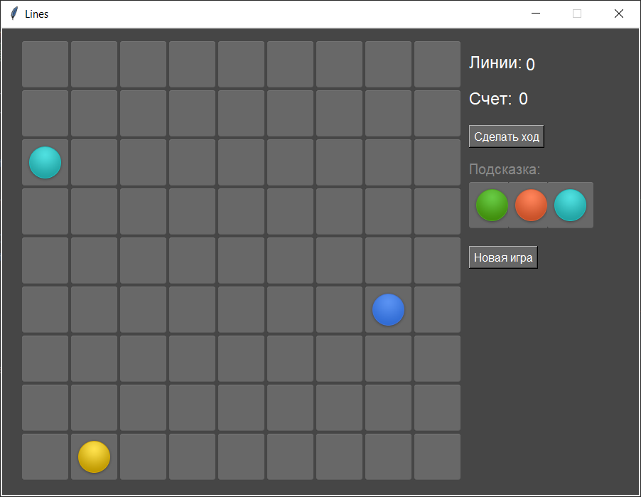
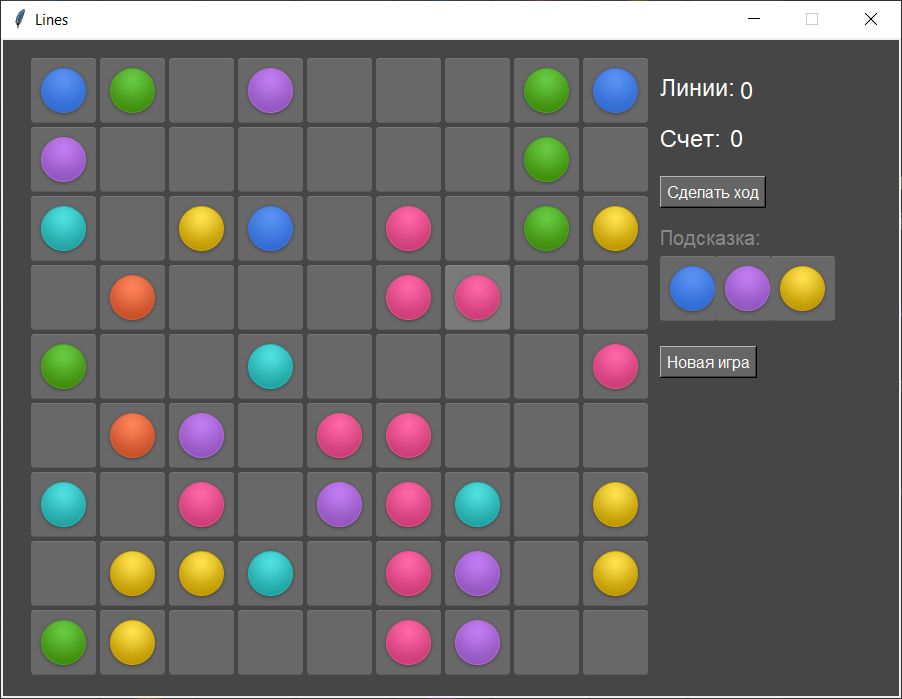
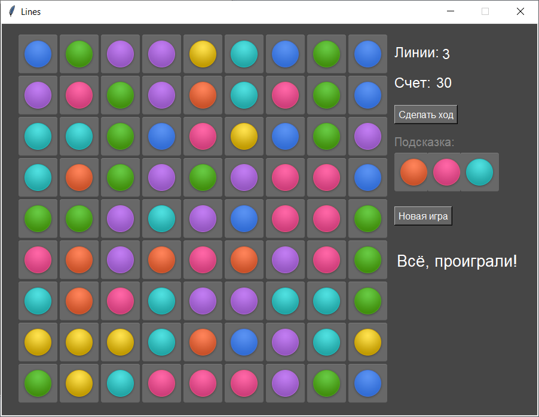

<p align="center">МИНИСТЕРСТВО НАУКИ  И ВЫСШЕГО ОБРАЗОВАНИЯ РОССИЙСКОЙ ФЕДЕРАЦИИ<br>
Федеральное государственное автономное образовательное учреждение высшего образования<br>
"КРЫМСКИЙ ФЕДЕРАЛЬНЫЙ УНИВЕРСИТЕТ им. В. И. ВЕРНАДСКОГО"<br>
ФИЗИКО-ТЕХНИЧЕСКИЙ ИНСТИТУТ<br>
Кафедра компьютерной инженерии и моделирования</p>
<br>
<h3 align="center">Отчёт по лабораторной работе № 3<br> по дисциплине "Программирование"</h3>
<br><br>
<p>студента 1 курса группы ПИ-б-о-201(1)<br>
Ильясова Эмира Шухратовича<br>
направления подготовки 09.03.04 "Программная инженерия"</p>
<br><br>
<table>
<tr><td>Научный руководитель<br> старший преподаватель кафедры<br> компьютерной инженерии и моделирования</td>
<td>(оценка)</td>
<td>Чабанов В.В.</td>
</tr>
</table>
<br><br>
<p align="center">Симферополь, 2020</p>
<hr>

## Цель:

1. Закрепить навыки разработки программ с простым графическим интерфейсом пользователя на зыке Python при помощи библиотеки Tkinter;
2. Получить представление о разработке простых игровых приложений.

## Постановка задачи
1. Используя стандартный модуль для разработки программ с графическим интерфейсом Tkinter реализуйте игру Lines на зыке Python.
2. В качестве образца графического интерфейса использовать игру-пример.

## Выполнение работы
В ходе выполнения работы была создана игра "Lines" (Рис. 1).


<p align="center">
Рисунок 1 - Начало игры
</p>

После каждого хода на поле добавляются 3 новых шара (Рис. 2).


<p align="center">
Рисунок 2 - добавление шаров после хода
</p>

При образовании ряда более 5 шаров, исчезают только первые 5 (Рис. 3-4)


<p align="center">
Рисунок 3 - образование линии, включающей более 5 фиолетовых шаров 
</p>


<p align="center">
Рисунок 4 - засчитывание только 5 фиолетовых шаров
</p>

При отсутствии свободных полей игра заканчивается (Рис. 5)


<p align="center">
Рисунок 5 - Игра закончена
</p>

Исходный код приложения:
```Python
from tkinter import *
from tkinter import ttk
from PIL import Image, ImageTk
from screeninfo import get_monitors
from random import randint

root = Tk()
root.title('Lines')

x_margins = 0
y_margins = 0

for m in get_monitors():
    x_margins = int((m.width - 900) / 2)
    y_margins = int((m.height - 660) / 2)


root.geometry(f'900x660+{x_margins}+{y_margins}')
root.resizable(width=False, height=False)
root.configure(bg='#464646')

all_images = {}
images = {}
list_of_balls = []
CellList = []
EmptyCells = []
is_rows = []
is_columns = []
is_diags = []
is_rdiags = []
Rows, Columns = 9, 9
gap = 4
global_padding = 20

game_over = False
game_over_label: Label = None

class MyField:
    current_label: int = -1
    image: Image
    imagetk: ImageTk.PhotoImage
    color: int = -1
    ball_size: int = -1
    dark: bool = True
    row: int = -1
    col: int = -1

    def update_cell(self):
        if self.ball_size != -1:
            self.image = Image.new("RGBA", all_images['cell_dark'].size)
            self.image.paste(all_images[f'{list_of_balls[self.color]}_{self.ball_size}'], (5, 5))
            if self.dark:
                self.image = Image.alpha_composite(all_images['cell_dark'], self.image)
            else:
                self.image = Image.alpha_composite(all_images['cell_light'], self.image)

            self.imagetk = ImageTk.PhotoImage(self.image)
        else:
            if self.dark:
                self.imagetk = images['cell_dark']
            else:
                self.imagetk = images['cell_light']

        canvas.itemconfigure(self.current_label, image=self.imagetk)


ListOfBalls = [MyField(), MyField(), MyField()]
ProcessClicks: bool = True
SelectedCell: MyField = None


def get_images():
    global all_images, images, list_of_balls
    all_images.update({
        "cell": Image.open("img/cell-bgr.png").convert('RGBA'),
    })
    all_images.update({
        "cell_dark": all_images["cell"].crop((2, 1, 67, 66)),
        "cell_light": all_images["cell"].crop((2, 70, 67, 135)),
    })
    _images_balls = {
        "ball-pink": Image.open("img/ball-pink.png").convert('RGBA'),
        "ball-red": Image.open("img/ball-red.png").convert('RGBA'),
        "ball-yellow": Image.open("img/ball-yellow.png").convert('RGBA'),
        "ball-green": Image.open("img/ball-green.png").convert('RGBA'),
        "ball-aqua": Image.open("img/ball-aqua.png").convert('RGBA'),
        "ball-blue": Image.open("img/ball-blue.png").convert('RGBA'),
        "ball-violet": Image.open("img/ball-violet.png").convert('RGBA'),
    }
    for k, v in _images_balls.items():
        for i in range(7):
            all_images[f"{k}_{i}"] = v.crop((0, i * 60, 55, i * 60 + 55))

    list_of_balls = ["ball-pink", "ball-red", "ball-yellow", "ball-green", "ball-aqua", "ball-blue", "ball-violet"]
    for k, v in all_images.items():
        images[k] = ImageTk.PhotoImage(v)


def objects_for_cells():
    global CellList, is_columns, is_rows
    for row in range(Rows):
        CellList.append(list())
        is_columns.append(list())
        for col in range(Columns):
            cell = MyField()

            cell.imagetk = images['cell_dark']
            cell.row = row
            cell.col = col

            CellList[row].append(cell)
            EmptyCells.append(cell)

            is_columns[row].append(cell)

    for col in range(Columns):
        is_rows.append(list())
        for row in range(Rows):
            is_rows[col].append(CellList[row][col])


def display_cells(canvas):
    global CellList
    for row in range(len(CellList)):
        for col in range(len(CellList[0])):
            cell = canvas.create_image(
                10 + global_padding + gap * row + CellList[row][col].imagetk.width() * row,
                global_padding + gap * col + CellList[row][col].imagetk.height() * col,
                image=CellList[row][col].imagetk,
                anchor=NW
            )
            canvas.tag_bind(cell, '<Button-1>', lambda event, thisrow=row, thiscol=col
                            : click(event, thisrow, thiscol))
            CellList[row][col].current_label = cell


def information_window(canvas):
    global score, score_val, ListOfBalls, lines_col, lines_erased

    x_pos = global_padding + 639
    y_pos = global_padding + 30

    lines_erased = 0
    canvas.create_text(x_pos, y_pos, text="Линии: ", font=("Arial", 18), fill="white", anchor=W)

    lines_col = canvas.create_text(x_pos + 80, y_pos-10, text=str(lines_erased), font=("Arial", 18), fill="white", anchor=NW)

    y_pos += 51 - 13
    canvas.create_text(x_pos, y_pos, text="Счет: ", font=("Arial", 18), fill="white", anchor=NW)

    score_val = 0
    score = canvas.create_text(x_pos + 70, y_pos, text=str(score_val), font=("Arial", 18), fill="white", anchor=NW)

    y_pos += 50
    Button(root, text='Сделать ход', font=("Arial", 12), fg='white', bg='#666666', activebackground='#777777',
           activeforeground='white', command=move_the_ball).place(x=x_pos, y=y_pos)

    y_pos += 50
    canvas.create_text(x_pos, y_pos, text="Подсказка:", font=("Arial", 15), fill="#888888", anchor=NW)
    y_pos += 30
    ListOfBalls[0].current_label = canvas.create_image(x_pos, y_pos, image=images['ball-green_0'], anchor=NW)
    ListOfBalls[1].current_label = canvas.create_image(x_pos + 55, y_pos, image=images['ball-green_0'], anchor=NW)
    ListOfBalls[2].current_label = canvas.create_image(x_pos + 110, y_pos, image=images['ball-green_0'], anchor=NW)

    y_pos += 90
    Button(root, text='Новая игра', font=("Arial", 12), fg='white', bg='#666666', activebackground='#777777',
           activeforeground='white', command=new_game).place(x=x_pos, y=y_pos)


def update_score(canvas, inc=None, reset=None):
    global score_val, lines_col, lines_erased
    if inc == None:
        if reset == None:
            return
        else:
            score_val = 0
    else:
        score_val += inc
        lines_erased += 1

    canvas.itemconfigure(score, text=str(score_val))
    canvas.itemconfigure(lines_col, text=str(int(lines_erased/5)))


def click(event, row, col):
    global ProcessClicks, SelectedCell
    if not ProcessClicks:
        return

    c = CellList[row][col]

    if SelectedCell == None:
        if c.ball_size == -1:
            return
        c.dark = False
        c.update_cell()
        SelectedCell = c
    else:
        if c.ball_size == -1:
            if not accessible_cell(SelectedCell.row, SelectedCell.col, row, col):
                return
            c.ball_size = SelectedCell.ball_size
            c.color = SelectedCell.color
            c.update_cell()

            SelectedCell.color, SelectedCell.ball_size = -1, -1

            SelectedCell.dark = True
            SelectedCell.update_cell()

            SelectedCell = None
            move_the_ball()
        elif c == SelectedCell:
            return
        else:
            SelectedCell.dark = True
            SelectedCell.update_cell()

            c.dark = False
            c.update_cell()
            SelectedCell = c


def accessible_cell(fromx, fromy, tox, toy):
    Dir = [[0, 1], [0, -1], [1, 0], [-1, 0]]
    queue = [(fromx, fromy)]
    visited = []

    while len(queue) > 0:
        p = queue[0]
        queue.pop(0)

        if visited.count(p) > 0:
            continue

        visited.append(p)

        if p == (tox, toy):
            return True

        for i in range(4):
            a = p[0] + Dir[i][0]
            b = p[1] + Dir[i][1]

            if a >= 0 and b >= 0 and a < Rows and b < Columns and visited.count((a, b)) == 0 and CellList[a][b].ball_size == -1:
                queue.append((a, b))
    return False


def clear_list(list_):
    deleted_some = False
    for col in list_:
        count = 0
        for elem in range(len(col) - 1):
            if col[elem].color == col[elem + 1].color and col[elem].ball_size != -1:
                count += 1
            else:
                if count >= 4:
                    deleted_some = True
                    for i in range(5):
                        c = col[elem - i]
                        c.color = -1
                        c.ball_size = -1
                        c.update_cell()
                        update_score(canvas, inc=2)
                count = 0
        if count >= 4:
            deleted_some = True
            for i in range(5):
                c = col[elem - i]
                c.color = -1
                c.ball_size = -1
                c.update_cell()
                update_score(canvas, inc=2)

    return deleted_some


def clear_rows():
    if (clear_list(is_rows) or
            clear_list(is_columns) or
            clear_list(is_diags) or
            clear_list(is_rdiags)):
        return False
    else:
        return True


def generate_ball_color():
    global ListOfBalls
    for i in range(3):
        c = MyField()

        c.color = randint(0, 6)
        c.ball_size = 0
        c.current_label = ListOfBalls[i].current_label

        c.update_cell()

        ListOfBalls[i] = c


def select_cell():
    for i in range(3):
        if len(EmptyCells) == 0:
            return False

        c = EmptyCells[randint(0, len(EmptyCells) - 1)]

        c.color = ListOfBalls[i].color
        c.ball_size = ListOfBalls[i].ball_size
        c.update_cell()

        EmptyCells.remove(c)
    return True


def move_the_ball(event=None):
    global game_over
    if clear_rows():
        EmptyCells.clear()
        for row in CellList:
            for elem in row:
                if elem.ball_size == -1: EmptyCells.append(elem)
        if not select_cell():
            game_over = True
            return
        EmptyCells.clear()
        for row in CellList:
            for elem in row:
                if elem.ball_size == -1: EmptyCells.append(elem)
        if len(EmptyCells) == 0:
            game_over = True
            return

        generate_ball_color()

    global SelectedCell
    if SelectedCell == None: return
    SelectedCell.dark = True
    SelectedCell.update_cell()
    SelectedCell = None


def new_game(event=None):
    global game_over_label
    global game_over
    game_over = False

    for row in range(Rows):
        for col in range(Columns):
            cell = CellList[row][col]
            cell.dark = True
            cell.ball_size = -1
            cell.update_cell()

    update_score(canvas, reset=True)
    move_the_ball()
    if game_over_label != None:
        game_over_label.destroy()
        root.update()
        game_over_label = None


get_images()

canvas = Canvas(root, bg='#464646', borderwidth=0, width=900, height=660)
canvas.place(x=0, y=0, relwidth=1, relheight=1)

objects_for_cells()
display_cells(canvas)
information_window(canvas)

generate_ball_color()
select_cell()
generate_ball_color()
# root.mainloop()
try:
    while True:
        root.update()
        if game_over:
            if game_over_label == None:
                game_over_label = Label(root, font=('Arial', 20), text='Всё, проиграли!', fg='white', bg='#464646')
                game_over_label.place(x=root.winfo_width() // 2 + 210, y=root.winfo_height() // 2 + 50)

except TclError as e:
    exit()

```

## Вывод по работе. 
Для достижения поставленной цели были выполнены все поставленные задачи, а именно:

	1) Закреплены навыки разработки программ с графическим интерфейсом Tkinter;
	2) Создана игра Lines с использованием графического интерфейса Tkinter.
	