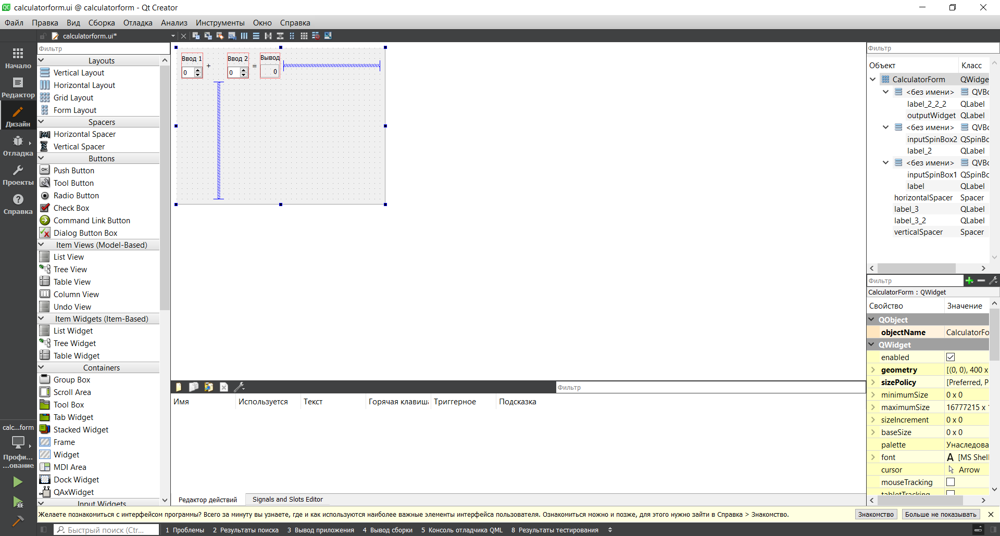

МИНИСТЕРСТВО НАУКИ  И ВЫСШЕГО ОБРАЗОВАНИЯ РОССИЙСКОЙ ФЕДЕРАЦИИ 
Федеральное государственное автономное образовательное учреждение высшего образования 
"КРЫМСКИЙ ФЕДЕРАЛЬНЫЙ УНИВЕРСИТЕТ им. В. И. ВЕРНАДСКОГО" 
ФИЗИКО-ТЕХНИЧЕСКИЙ ИНСТИТУТ 
Кафедра компьютерной инженерии и моделирования

 
<h3 align="center">Отчёт по лабораторной работе № 4  по дисциплине "Программирование"</h3>
  

студента 1 курса группы ПИ-б-о-201(1) 
Ильясова Эмира Шухратовича 
направления подготовки 09.03.04 "Программная инженерия"

  
<table>
<tr><td>Научный руководитель  старший преподаватель кафедры  компьютерной инженерии и моделирования</td>
<td>(оценка)</td>
<td>Чабанов В.В.</td>
</tr>
</table>
  

Симферополь, 2021

## Цель:

1. Установить фреймворк Qt;
2. Изучить основные возможности создания и отладки программ в IDE Qt Creator.
## Постановка задачи
1. Настроить рабочее окружение, для разработки программного обеспечения при помощи Qt и IDE Qt Creator, а также изучить базовые возможности данного фреймворка.

## Выполнение работы

### Задание 1
Вначале был скачан QT Creator с помощью пакетного менеджера, а так же компилятор C++ и дебаггер: 
`pacman -S qtcreator qt5-examples lldb llvm clang`

Был открыт пример **Calculator Form Example**.

В настройках был настроен проект, нажата кнопка **Configure**, в редакторе была открыта форма и изменен текст.

Рисунок 1. Шаблон проекта

### Задание 2
**Как изменить цветовую схему (оформление) среды?** 
`Инструменты` -> `Параметры` -> `Среда` -> `Интерфейс` -> `Тема`

**Как закомментировать/раскомментировать блок кода средствами Qt Creator? Имеется ввиду комбинация клавиш или пункт меню.** 
`Ctrl+/`

**Как открыть в проводнике Windows папку с проектом средствами Qt Creator?** 
В редакторе выбрать файл -> нажать по нему ПКМ -> `Открыть в проводнике`

**Какое расширение файла-проекта используется Qt Creator? Может быть несколько ответов.** 
`<имя проекта>.pro` для билд-системы от QT 
`CMakeLists.txt` для билд-системы CMake и файлы `*.cmake` для библиотек.

**Как запустить код без отладки?** 
Нажать на зелёный треугольник слева снизу или `Сборка` -> `Запустить (Ctrl+R)`

**Как запустить код в режиме отладки?** 
Нажать на зелёный треугольник с жучком (багом) слева снизу или `Отладка` -> `Начать отладку` -> `Начать отладку запускающего проекта (F5)`

**Как установить/убрать точку останова (breakpoint)?** 
Нажать слева от нумерации строки либо переместить курсор на нужную строку и нажать `Отладка` -> `Поставить/снять точку останова (F9)`

### Задание 3
**Чему равны переменные i и d в 6 строке (тут и далее, нужно написать значения)?** 
d = 1.0070164569291289e-317 
i = 0

**Чему равны переменные i и d в 7 строкe?** 
d = 1.0070164569291289e-317 
i = 5

**Чему равны переменные i и d в 8 строке?** 
d = 5.0 
i = 5

## Вывод
В ходе работы была установлена кроссплатформенная среда разработки Qt Creator. Также были изучены основные возможности создания и отладки программ в IDE Qt Creator.